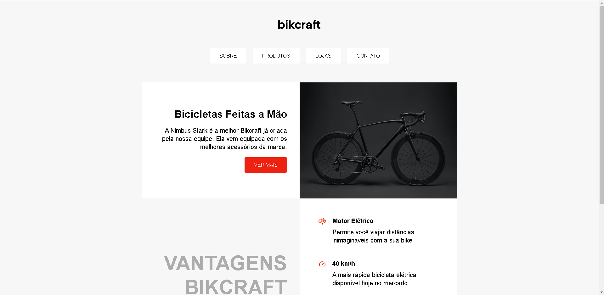

## Projeto simples usando HTML e CSS para revisar conceitos básicos.

Projeto Finalizado ✔

Nesse exercício foram revisados concetios de posicionamento usando os displays grid e flex do CSS. 😁

   
   
      
  
  

